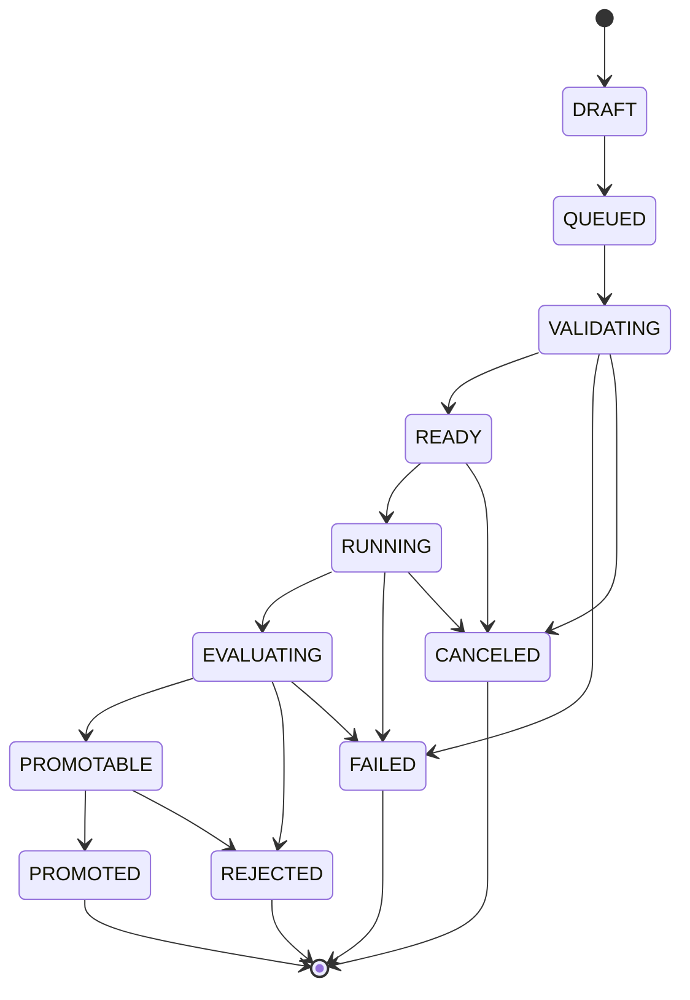

# Cogochi AI Implementation Contracts

Last updated: 2026-03-07

This document closes the remaining design gaps for the Cogochi AI subsystem.

It defines:

- exact service signatures
- training job state transitions
- fine-tune artifact storage contracts
- benchmark dataset schemas
- fixed reflection failure taxonomy
- promotion compare rules
- Ollama and Qwen provider I/O contracts
- long-term multiuser and async PvP storage models

If this document conflicts with a higher-level design note, this document wins for implementation.

## 1. Contract boundaries

The AI subsystem is implemented in three concentric layers.

1. Runtime layer
- retrieval
- context assembly
- provider call
- decision validation

2. Evaluation layer
- squad resolution
- scoring
- reflection
- reward

3. Training layer
- dataset generation
- queue orchestration
- SFT and LoRA artifacts
- promotion and rollback

## 2. Canonical service modules

The following files are required and their interfaces are fixed unless this document is updated.

### 2.1 `src/lib/aimon/services/reflectionService.ts`

Purpose:

- classify failures
- build structured reflection notes
- generate durable memory writeback cards

```ts
import type {
  AgentDecisionTrace,
  AgentEvalResult,
  EvalMatchResult,
  EvalMetrics,
  EvalScenario,
  FailureMode,
  MemoryRecord,
  ReflectionNote
} from '$lib/aimon/types';

export interface ReflectionInput {
  scenario: EvalScenario;
  matchResult: EvalMatchResult;
  agentResult: AgentEvalResult;
  decisionTrace: AgentDecisionTrace | null;
  priorMemories: MemoryRecord[];
}

export interface ReflectionOutput {
  note: ReflectionNote;
  durableMemory: MemoryRecord;
  followupActions: Array<{
    type: 'PROMPT_TUNE' | 'RETRIEVAL_TUNE' | 'MEMORY_COMPACT' | 'NONE';
    reason: string;
  }>;
}

export function classifyFailureMode(input: ReflectionInput): FailureMode | null;
export function buildReflectionNote(input: ReflectionInput): ReflectionNote;
export function buildDurableMemoryRecord(input: ReflectionInput, note: ReflectionNote): MemoryRecord;
export function reflectAgentEval(input: ReflectionInput): ReflectionOutput;
export function reflectMatch(
  scenario: EvalScenario,
  matchResult: EvalMatchResult,
  decisionTracesByAgent: Record<string, AgentDecisionTrace>,
  memoryByAgent: Record<string, MemoryRecord[]>
): Record<string, ReflectionOutput>;
```

### 2.2 `src/lib/aimon/services/evalService.ts`

Purpose:

- resolve squad consensus
- compute per-agent metrics
- compute team score
- build reward packet
- compare candidates for promotion

```ts
import type {
  AgentDecisionTrace,
  AgentEvalResult,
  BattleOutcome,
  EvalMatchResult,
  EvalMetrics,
  EvalScenario,
  PromotionCandidateComparison,
  RewardPacket
} from '$lib/aimon/types';

export interface SquadConsensusInput {
  scenario: EvalScenario;
  traces: AgentDecisionTrace[];
}

export interface SquadConsensus {
  finalAction: 'LONG' | 'SHORT' | 'FLAT';
  finalConfidence: number;
  vetoApplied: boolean;
  executorAgentId: string | null;
  rationale: string;
}

export interface EvalScoringInput {
  scenario: EvalScenario;
  consensus: SquadConsensus;
  traces: AgentDecisionTrace[];
  marketOutcome: {
    outcome: BattleOutcome;
    priceDeltaPct: number;
    closingRegime: string;
  };
}

export function resolveSquadConsensus(input: SquadConsensusInput): SquadConsensus;
export function scoreAgentDecision(input: EvalScoringInput, trace: AgentDecisionTrace): AgentEvalResult;
export function scoreTeamMetrics(input: EvalScoringInput): EvalMetrics;
export function buildRewardPacket(matchResult: EvalMatchResult): RewardPacket;
export function comparePromotionCandidates(
  baseline: EvalMetrics,
  candidate: EvalMetrics,
  benchmarkPackId: string
): PromotionCandidateComparison;
```

### Supporting runtime helpers already used by the MVP

These supporting services are part of the current code path and must stay documented even though they are smaller than the training/eval orchestrators.

```ts
// src/lib/aimon/services/contextAssembler.ts
import type {
  AgentContextPacket,
  AgentDecisionContext,
  BattleRetrievedMemory,
  DataSourceBinding,
  DataSourceKind,
  EvalScenario,
  MarketState,
  OwnedAgent
} from '$lib/aimon/types';

export function buildAgentDecisionContext(
  agent: OwnedAgent,
  market: MarketState,
  retrievedMemories: BattleRetrievedMemory[],
  squadNotes: string[],
  tacticPreset: AgentDecisionContext['tacticPreset'],
  scenario?: Pick<EvalScenario, 'id' | 'label' | 'symbol' | 'timeframe' | 'objective' | 'allowedDataSourceKinds'>,
  activeDataSourceKinds?: DataSourceKind[]
): AgentDecisionContext;

export function buildAgentContextPacket(
  agent: OwnedAgent,
  decisionContext: AgentDecisionContext,
  activeDataSources?: DataSourceBinding[]
): AgentContextPacket;

// src/lib/aimon/services/memoryService.ts
import type { AgentRole, MemoryBank, MemoryRecord, RetrievalPolicy } from '$lib/aimon/types';

export interface MemoryRetrievalContext {
  role: AgentRole;
  symbol: string;
  timeframe: string;
  regime: string;
  tags: string[];
  scenarioStartAt: number;
}

export interface MemoryRetrievalCandidate {
  record: MemoryRecord;
  totalScore: number;
}

export function retrieveRelevantMemories(
  bank: MemoryBank | null,
  policy: RetrievalPolicy,
  context: MemoryRetrievalContext
): MemoryRetrievalCandidate[];
```

### 2.3 `src/lib/aimon/services/embeddingProvider.ts`

Purpose:

- generate embeddings for memory and dataset records

```ts
import type { EmbeddingProviderConfig, EmbeddingVector } from '$lib/aimon/types';

export interface EmbeddingProvider {
  id: string;
  label: string;
  dimensions: number;
  embedText(text: string, config?: EmbeddingProviderConfig): Promise<EmbeddingVector>;
  embedBatch(texts: string[], config?: EmbeddingProviderConfig): Promise<EmbeddingVector[]>;
}

export function getEmbeddingProvider(providerId?: string): EmbeddingProvider;
export function cosineSimilarity(left: EmbeddingVector, right: EmbeddingVector): number;
```

### 2.4 `src/lib/aimon/services/retrievalIndex.ts`

Purpose:

- manage the hybrid retrieval index
- merge lexical and embedding scores

```ts
import type {
  MemoryBank,
  MemoryRecord,
  MemoryRetrievalContext,
  RetrievalPolicy,
  RetrievedMemoryItem
} from '$lib/aimon/types';

export interface RetrievalIndex {
  upsertMemory(record: MemoryRecord): Promise<void>;
  upsertMany(records: MemoryRecord[]): Promise<void>;
  removeMemory(memoryId: string): Promise<void>;
  query(
    bank: MemoryBank,
    context: MemoryRetrievalContext,
    policy: RetrievalPolicy,
    limit?: number
  ): Promise<RetrievedMemoryItem[]>;
}

export function createRetrievalIndex(): RetrievalIndex;
export function scoreMemoryHybrid(
  record: MemoryRecord,
  context: MemoryRetrievalContext,
  policy: RetrievalPolicy
): RetrievedMemoryItem;
```

### 2.5 `src/lib/aimon/services/datasetBuilder.ts`

Purpose:

- convert matches and reflections into trainable examples
- emit one match-level dataset bundle containing per-agent examples

```ts
import type {
  AgentContextPacket,
  AgentDecisionTrace,
  EvalMatchResult,
  PreferenceTrainingExample,
  ReflectionNote,
  SftTrainingExample,
  TrainingDatasetBundle
} from '$lib/aimon/types';

export function buildSftExample(
  context: AgentContextPacket,
  preferredOutput: AgentDecisionTrace,
  qualityScore: number
): SftTrainingExample;

export function buildPreferenceExample(
  context: AgentContextPacket,
  chosen: AgentDecisionTrace,
  rejected: AgentDecisionTrace,
  failureMode: string
): PreferenceTrainingExample;

export function buildDatasetFromEval(
  matchResult: EvalMatchResult,
  contextsByAgent: Record<string, AgentContextPacket>,
  reflectionsByAgent: Record<string, ReflectionNote>
): TrainingDatasetBundle;

export function splitDatasetBundle(
  bundle: TrainingDatasetBundle,
  ratios?: { train: number; valid: number; test: number }
): TrainingDatasetBundle;
```

### 2.6 `src/lib/aimon/services/trainingOrchestrator.ts`

Purpose:

- queue jobs
- validate prerequisites
- update job state
- hand off to prompt, retrieval, memory, or fine-tune routines

```ts
import type {
  TrainingJob,
  TrainingJobId,
  TrainingJobResult,
  TrainingJobState,
  TrainingJobType
} from '$lib/aimon/types';

export interface QueueTrainingJobInput {
  agentId: string;
  type: TrainingJobType;
  requestedBy: 'PLAYER' | 'SYSTEM';
  hypothesis: string;
  benchmarkPackId: string;
  payload: Record<string, unknown>;
  changes?: string[];
}

export function queueTrainingJob(input: QueueTrainingJobInput): TrainingJobId;
export function validateTrainingJob(job: TrainingJob): TrainingJobResult;
export function startTrainingJob(jobId: TrainingJobId): Promise<TrainingJobResult>;
export function finalizeTrainingJob(jobId: TrainingJobId, result: TrainingJobResult): void;
export function cancelTrainingJob(jobId: TrainingJobId, reason: string): void;
export function promoteTrainingJob(jobId: TrainingJobId): Promise<TrainingJobResult>;
```

### 2.7 `src/lib/aimon/services/fineTuneService.ts`

Purpose:

- package datasets
- call LoRA or SFT backends
- register artifacts
- evaluate candidates

```ts
import type {
  FineTuneArtifactManifest,
  FineTuneJobPayload,
  ModelArtifact,
  PromotionCandidateComparison,
  TrainingDatasetBundle
} from '$lib/aimon/types';

export function buildFineTuneBundle(
  bundle: TrainingDatasetBundle,
  agentId: string,
  baseModelId: string,
  trainingJobId: string,
  kind: 'SFT' | 'LORA'
): FineTuneJobPayload;
export function runSftJob(payload: FineTuneJobPayload): Promise<FineTuneArtifactManifest>;
export function runLoraJob(payload: FineTuneJobPayload): Promise<FineTuneArtifactManifest>;
export function registerArtifact(manifest: FineTuneArtifactManifest): ModelArtifact;
export function evaluateArtifactAgainstBenchmark(
  artifactId: string,
  benchmarkPackId: string
): Promise<PromotionCandidateComparison>;
export function promoteArtifact(artifactId: string, agentId: string): Promise<void>;
export function rollbackArtifact(agentId: string, previousArtifactId: string): Promise<void>;
```

### 2.8 `src/lib/aimon/services/benchmarkManifestService.ts`

Purpose:

- emit benchmark run manifests from actual eval executions
- centralize runtime noise metadata and authoritative gating flags

```ts
import type {
  AgentDecisionTrace,
  BenchmarkRunManifest,
  EvalMatchResult,
  OwnedAgent,
  RuntimeConfig
} from '$lib/aimon/types';

export interface BuildBenchmarkRunManifestInput {
  matchResult: EvalMatchResult;
  runtime: RuntimeConfig;
  agents: OwnedAgent[];
  decisionTraces: AgentDecisionTrace[];
  startedAt: number;
  finishedAt?: number;
}

export function buildBenchmarkRunManifest(
  input: BuildBenchmarkRunManifestInput
): BenchmarkRunManifest;
```

### 2.9 `src/lib/aimon/services/modelProvider.ts`

Purpose:

- normalize provider inputs and outputs

```ts
import type {
  AgentContextPacket,
  AgentDecisionTrace,
  ProviderCallResult,
  RuntimeConfig
} from '$lib/aimon/types';

export interface RuntimeModelProvider {
  id: string;
  label: string;
  invoke(context: AgentContextPacket, config: RuntimeConfig): Promise<ProviderCallResult>;
  test(config: RuntimeConfig): Promise<{ ok: boolean; message: string }>;
}

export function runRuntimeDecision(
  context: AgentContextPacket,
  config: RuntimeConfig
): Promise<ProviderCallResult>;

export function normalizeProviderResponse(
  raw: unknown,
  context: AgentContextPacket
): AgentDecisionTrace;
```

## 3. Canonical type additions

These types must be added to [types.ts](/Users/ej/Downloads/maxidoge-clones/Cogochi/src/lib/aimon/types.ts) before the corresponding services are implemented.

```ts
export type FailureMode =
  | 'REGIME_MISMATCH'
  | 'OVERCONFIDENCE'
  | 'UNDERCONFIDENCE'
  | 'LATE_ENTRY'
  | 'EARLY_EXIT'
  | 'RETRIEVAL_MISS'
  | 'RETRIEVAL_NOISE'
  | 'EVIDENCE_CONFLICT_IGNORED'
  | 'RISK_GUARD_BREACH'
  | 'TOOL_MISUSE'
  | 'SQUAD_COORDINATION_BREAK'
  | 'POLICY_DOCTRINE_VIOLATION'
  | 'DATA_SCOPE_VIOLATION'
  | 'JSON_SCHEMA_INVALID'
  | 'PROVIDER_TIMEOUT'
  | 'PROVIDER_EMPTY_OUTPUT';

export type TrainingJobType =
  | 'PROMPT_TUNE'
  | 'RETRIEVAL_TUNE'
  | 'MEMORY_COMPACT'
  | 'SFT'
  | 'LORA'
  | 'CPT';

export type TrainingJobState =
  | 'DRAFT'
  | 'QUEUED'
  | 'VALIDATING'
  | 'READY'
  | 'RUNNING'
  | 'EVALUATING'
  | 'PROMOTABLE'
  | 'PROMOTED'
  | 'REJECTED'
  | 'FAILED'
  | 'CANCELED';

export type TrainingJobId = string;

export interface ReflectionNote {
  id: string;
  agentId: string;
  scenarioId: string;
  verdict: 'GOOD' | 'MIXED' | 'BAD';
  failureMode: FailureMode | null;
  lesson: string;
  actionChange?: string;
  confidenceDelta?: number;
  retrievalDelta?: string;
  promptDelta?: string;
  createdAt: number;
}

export interface EmbeddingVector {
  dimensions: number;
  values: number[];
}

export interface EmbeddingProviderConfig {
  model?: string;
  normalize?: boolean;
}

export interface ProviderCallResult {
  trace: AgentDecisionTrace;
  rawText: string;
  latencyMs: number;
  tokensIn?: number;
  tokensOut?: number;
  fallbackUsed: boolean;
  providerError?: string;
}

export interface SftTrainingExample {
  id: string;
  agentId: string;
  scenarioId: string;
  benchmarkPackId: string;
  messages: Array<{
    role: 'system' | 'user' | 'assistant';
    content: string;
  }>;
  qualityScore: number;
  createdAt: number;
}

export interface PreferenceTrainingExample {
  id: string;
  agentId: string;
  scenarioId: string;
  benchmarkPackId: string;
  prompt: string;
  chosen: string;
  rejected: string;
  failureMode: FailureMode;
  qualityScore: number;
  createdAt: number;
}

export interface TrainingDatasetBundle {
  id: string;
  agentIds: string[];
  benchmarkPackId: string;
  sourceMatchId: string;
  sftExamples: SftTrainingExample[];
  preferenceExamples: PreferenceTrainingExample[];
  trainIds: string[];
  validIds: string[];
  testIds: string[];
  createdAt: number;
}

export interface FineTuneArtifactManifest {
  artifactId: string;
  agentId: string;
  baseModelId: string;
  trainingJobId: string;
  benchmarkPackId: string;
  kind: 'PROMPT_VARIANT' | 'SFT' | 'LORA';
  formatVersion: string;
  storageUri: string;
  metrics: EvalMetrics;
  config: {
    provider: 'OLLAMA' | 'OPENAI_COMPAT' | 'LOCAL';
    model: string;
    epochs?: number;
    learningRate?: number;
    rank?: number;
    alpha?: number;
    batchSize?: number;
  };
  createdAt: number;
}

export interface TrainingJob {
  id: TrainingJobId;
  agentId: string;
  type: TrainingJobType;
  state: TrainingJobState;
  requestedBy: 'PLAYER' | 'SYSTEM';
  hypothesis: string;
  benchmarkPackId: string;
  payload: Record<string, unknown>;
  validationErrors: string[];
  resultArtifactId?: string;
  resultMetrics?: EvalMetrics;
  createdAt: number;
  updatedAt: number;
  startedAt?: number;
  finishedAt?: number;
}

export interface TrainingJobResult {
  ok: boolean;
  state: TrainingJobState;
  message: string;
  artifactId?: string;
  metrics?: EvalMetrics;
}

export interface PromotionCandidateComparison {
  benchmarkPackId: string;
  baselineArtifactId?: string;
  candidateArtifactId?: string;
  passed: boolean;
  reasons: string[];
  deltas: {
    total: number;
    returnScore: number;
    riskScore: number;
    accuracyScore: number;
    calibrationScore: number;
    reasoningScore: number;
    coordinationScore: number;
  };
}
```

## 4. Training job state machine

The training queue is not allowed to use free-form transitions.

Only the following transitions are valid.



### 4.1 Transition rules

`DRAFT -> QUEUED`
- player or system creates the job

`QUEUED -> VALIDATING`
- orchestrator checks dataset size, prompt variant existence, model availability

`VALIDATING -> READY`
- all prerequisites pass

`VALIDATING -> FAILED`
- invalid dataset
- missing base model
- unsupported provider capability

`READY -> RUNNING`
- worker has lock

`RUNNING -> EVALUATING`
- training or mutation completed and a candidate variant exists

`EVALUATING -> PROMOTABLE`
- candidate beats baseline and passes hard gates

`EVALUATING -> REJECTED`
- candidate is valid but does not beat baseline

`PROMOTABLE -> PROMOTED`
- user or system promotes the candidate

### 4.2 Job-specific prerequisites

`PROMPT_TUNE`
- at least 5 recent evals
- at least 2 failure reflections or 2 weak reasoning reflections

`RETRIEVAL_TUNE`
- at least 10 retrieval events
- at least 3 `RETRIEVAL_MISS` or `RETRIEVAL_NOISE` classifications

`MEMORY_COMPACT`
- memory bank usage >= 70%

`SFT`
- at least 40 SFT examples
- validation split present

`LORA`
- at least 30 SFT examples or 20 preference examples

`CPT`
- not allowed in MVP

## 5. Fine-tune artifact storage format

### 5.1 Logical storage path

Canonical local path:

`storage/aimon/artifacts/{agentId}/{artifactId}/`

Canonical cloud path:

`aimon-artifacts/{agentId}/{artifactId}/`

### 5.2 Required files

Every artifact directory must contain:

- `manifest.json`
- `metrics.json`
- `training_config.json`
- `dataset_manifest.json`
- `lineage.json`

Artifact-specific payload:

`PROMPT_VARIANT`
- `prompt_variant.json`

`SFT`
- `checkpoint/`
- `tokenizer/`

`LORA`
- `adapter/adapter_model.safetensors`
- `adapter/adapter_config.json`

### 5.3 `manifest.json`

```json
{
  "artifactId": "artifact-20260307-001",
  "agentId": "agent-btc-01",
  "baseModelId": "qwen2.5-7b-instruct",
  "trainingJobId": "job-20260307-001",
  "benchmarkPackId": "bench-v1-core",
  "kind": "LORA",
  "formatVersion": "1.0.0",
  "storageUri": "storage/aimon/artifacts/agent-btc-01/artifact-20260307-001",
  "createdAt": 1772862000000
}
```

### 5.4 `metrics.json`

```json
{
  "totalScore": 0.71,
  "returnScore": 0.68,
  "riskScore": 0.77,
  "accuracyScore": 0.7,
  "calibrationScore": 0.66,
  "reasoningScore": 0.73,
  "coordinationScore": 0.69,
  "sampleSize": 24,
  "benchmarkPackId": "bench-v1-core"
}
```

### 5.5 `lineage.json`

```json
{
  "promotedFromArtifactId": "artifact-20260302-002",
  "basePromptVariantId": "variant-20260306-001",
  "retrievalPolicyVersion": "retrieval-v4",
  "memoryCompactionLevel": 2,
  "sourceDatasetBundleId": "dataset-20260307-001"
}
```

## 6. Benchmark dataset schemas

### 6.1 Benchmark pack structure

Canonical path:

`storage/aimon/benchmarks/{benchmarkPackId}/`

Required files:

- `pack_manifest.json`
- `scenarios.jsonl`
- `expected_outcomes.jsonl`
- `grading_rubric.json`

### 6.2 `pack_manifest.json`

```json
{
  "benchmarkPackId": "bench-v1-core",
  "label": "Core Market Eval Pack",
  "version": "1.0.0",
  "scenarioCount": 24,
  "createdAt": 1772862000000,
  "notes": "Balanced across trend, range, macro defense, and onchain chase setups."
}
```

### 6.3 Scenario JSONL row

```json
{
  "scenarioId": "btc-breakout-pulse-0007",
  "templateId": "btc-breakout-pulse",
  "symbol": "BTCUSDT",
  "timeframe": "15m",
  "objective": "Capture directional continuation early without overtrading the breakout.",
  "allowedDataKinds": ["PRICE", "NEWS", "USER_NOTE"],
  "market": {
    "regime": "TREND",
    "price": 103225.2,
    "priceChange5m": 0.74,
    "volatility": 0.29,
    "fearGreed": 64,
    "fundingRate": 0.0008,
    "openInterestChange": 1.9
  },
  "evidence": [
    {
      "kind": "PRICE",
      "sourceId": "ds-price-core",
      "title": "15m breakout above prior balance high",
      "summary": "Price reclaimed the prior range high with rising open interest."
    }
  ]
}
```

### 6.4 Expected outcome row

```json
{
  "scenarioId": "btc-breakout-pulse-0007",
  "preferredAction": "LONG",
  "confidenceBand": [0.62, 0.84],
  "failureTags": ["late_entry", "overconfidence"],
  "gradingHints": {
    "mustMention": ["breakout", "open interest"],
    "mustAvoid": ["mean reversion short"]
  }
}
```

### 6.5 SFT training example schema

```json
{
  "id": "sft-20260307-001",
  "agentId": "agent-btc-01",
  "scenarioId": "btc-breakout-pulse-0007",
  "benchmarkPackId": "bench-v1-core",
  "messages": [
    { "role": "system", "content": "You are a disciplined AIMON evaluation agent." },
    { "role": "user", "content": "Scenario packet + retrieved memories + output schema" },
    { "role": "assistant", "content": "{\"action\":\"LONG\",\"confidence\":0.74,\"thesis\":\"...\"}" }
  ],
  "qualityScore": 0.91,
  "createdAt": 1772862000000
}
```

### 6.6 Preference training example schema

```json
{
  "id": "pref-20260307-001",
  "agentId": "agent-btc-01",
  "scenarioId": "btc-breakout-pulse-0007",
  "benchmarkPackId": "bench-v1-core",
  "prompt": "Scenario packet + memories",
  "chosen": "{\"action\":\"FLAT\",\"confidence\":0.52,\"thesis\":\"breakout already extended\"}",
  "rejected": "{\"action\":\"LONG\",\"confidence\":0.88,\"thesis\":\"chase continuation\"}",
  "failureMode": "OVERCONFIDENCE",
  "qualityScore": 0.87,
  "createdAt": 1772862000000
}
```

## 7. Fixed reflection failure taxonomy

These labels are closed-set for MVP and must not be generated freely.

### 7.1 Market reading failures

`REGIME_MISMATCH`
- action assumed trend while scenario was range, or the reverse

`LATE_ENTRY`
- direction may be correct but the action timing came after expansion

`EARLY_EXIT`
- risk was cut too early relative to scenario objective

### 7.2 Confidence failures

`OVERCONFIDENCE`
- confidence too high relative to evidence quality

`UNDERCONFIDENCE`
- action or thesis was timid despite strong aligned evidence

### 7.3 Retrieval failures

`RETRIEVAL_MISS`
- the correct memory existed but was not retrieved

`RETRIEVAL_NOISE`
- irrelevant memories crowded out relevant evidence

### 7.4 Policy and tool failures

`EVIDENCE_CONFLICT_IGNORED`
- conflicting evidence was present but ignored

`RISK_GUARD_BREACH`
- action violated risk tolerance or doctrine limits

`TOOL_MISUSE`
- wrong tool path or incorrect summarization/retrieval behavior

`POLICY_DOCTRINE_VIOLATION`
- user doctrine or hard policy rule was ignored

`DATA_SCOPE_VIOLATION`
- the agent used data kinds not allowed by the scenario

### 7.5 Coordination and runtime failures

`SQUAD_COORDINATION_BREAK`
- role outputs conflicted without valid consensus logic

`JSON_SCHEMA_INVALID`
- provider output could not be normalized into valid trace JSON

`PROVIDER_TIMEOUT`
- request exceeded timeout budget

`PROVIDER_EMPTY_OUTPUT`
- provider returned no parseable completion

## 8. Promotion compare rules

Promotion is not subjective. It must follow hard gates first, then soft scores.

### 8.1 Minimum benchmark sample

Candidate must be evaluated on:

- at least 24 benchmark scenarios total
- at least 6 `TREND`
- at least 6 `RANGE`
- at least 4 macro-sensitive cases
- at least 4 high-volatility cases

### 8.2 Hard gates

Candidate is automatically rejected if any of the following is true:

- `candidate.totalScore < baseline.totalScore + 0.02`
- `candidate.riskScore < baseline.riskScore - 0.03`
- `candidate.reasoningScore < baseline.reasoningScore - 0.04`
- `candidate.calibrationScore < 0.55`
- more than 5% of outputs are invalid JSON
- more than 10% of calls required heuristic fallback

### 8.3 Soft advantage rules

If hard gates pass, candidate is promotable when at least two conditions are true:

- `candidate.returnScore >= baseline.returnScore + 0.03`
- `candidate.accuracyScore >= baseline.accuracyScore + 0.03`
- `candidate.reasoningScore >= baseline.reasoningScore + 0.03`
- `candidate.coordinationScore >= baseline.coordinationScore + 0.03`

### 8.4 Tie-break rules

If total score delta is within `0.02`:

1. higher risk score wins
2. if still tied, higher reasoning score wins
3. if still tied, lower fallback rate wins
4. if still tied, do not promote automatically

### 8.5 Rollback rule

If a promoted artifact later underperforms the previous promoted artifact by:

- `totalScore <= -0.03` over the next 24 benchmark runs

then automatic rollback is allowed.

## 9. Ollama and Qwen I/O contracts

### 9.1 Normalized request contract

All providers receive a normalized `AgentContextPacket`.

The server adapter is responsible for translating it to provider-specific payloads.

### 9.2 Ollama request contract

Endpoint:

- `POST {baseUrl}/api/chat`

Body:

```json
{
  "model": "qwen2.5:7b-instruct",
  "stream": false,
  "format": "json",
  "messages": [
    { "role": "system", "content": "Return only valid JSON." },
    { "role": "user", "content": "Normalized context packet rendered as prompt text." }
  ],
  "options": {
    "temperature": 0.2
  }
}
```

### 9.3 Ollama response contract

Accepted response sources:

- `response`
- `message.content`

The normalized parser must:

1. extract text
2. find the first valid JSON object
3. validate required keys
4. clamp confidence
5. attach provider metadata

### 9.4 OpenAI-compatible request contract

Endpoint:

- `POST {baseUrl}/chat/completions`

Body:

```json
{
  "model": "qwen2.5-7b-instruct",
  "temperature": 0.2,
  "response_format": { "type": "json_object" },
  "messages": [
    { "role": "system", "content": "Return only valid JSON." },
    { "role": "user", "content": "Normalized context packet rendered as prompt text." }
  ]
}
```

### 9.5 Normalized response contract

Every provider must normalize to:

```json
{
  "trace": {
    "ownedAgentId": "agent-btc-01",
    "agentName": "Pulse",
    "role": "SCOUT",
    "action": "LONG",
    "confidence": 0.74,
    "thesis": "string",
    "invalidation": "string",
    "evidenceTitles": ["string"],
    "generatedAt": 1772862000000,
    "providerId": "ollama",
    "providerLabel": "Ollama · qwen2.5:7b-instruct",
    "fallbackUsed": false
  },
  "rawText": "raw completion",
  "latencyMs": 842,
  "tokensIn": 1142,
  "tokensOut": 126,
  "fallbackUsed": false
}
```

### 9.6 Retry and timeout rules

- timeout budget: `20_000ms` default
- one retry on invalid JSON
- zero retries on authentication failure
- fallback to heuristic on:
  - timeout
  - empty output
  - repeated invalid JSON

### 9.7 Qwen-specific rules

When using local Qwen:

- prefer instruct checkpoints only
- temperature must remain in `[0.0, 0.4]` for eval mode
- output schema must be injected every call
- no chain-of-thought storage in durable memory
- only store normalized thesis/invalidation/evidence fields

## 10. Long-term multiuser and async PvP storage model

Live synchronous PvP is not required, but async PvP must be modelled now so the local design does not dead-end.

### 10.1 Core entities

```ts
export interface PlayerAccount {
  id: string;
  handle: string;
  rating: number;
  createdAt: number;
  updatedAt: number;
}

export interface AgentSnapshot {
  id: string;
  ownerId: string;
  ownedAgentId: string;
  snapshotVersion: string;
  baseModelId: string;
  role: AgentRole;
  promptFingerprint: string;
  retrievalPolicyVersion: string;
  artifactId?: string;
  createdAt: number;
}

export interface SquadSnapshot {
  id: string;
  ownerId: string;
  squadId: string;
  agentSnapshotIds: string[];
  tacticPreset: SquadTacticPreset;
  benchmarkPackId: string;
  createdAt: number;
}

export interface GhostChallenge {
  id: string;
  attackerId: string;
  defenderSnapshotId: string;
  scenarioId: string;
  status: 'OPEN' | 'RUNNING' | 'RESOLVED' | 'EXPIRED';
  createdAt: number;
  resolvedAt?: number;
}

export interface AsyncMatchRecord {
  id: string;
  challengeId: string;
  attackerSnapshotId: string;
  defenderSnapshotId: string;
  scenarioId: string;
  outcome: BattleOutcome;
  attackerMetrics: EvalMetrics;
  defenderMetrics: EvalMetrics;
  replayUri?: string;
  createdAt: number;
}

export interface LeaderboardEntry {
  playerId: string;
  rating: number;
  wins: number;
  losses: number;
  lastMatchAt?: number;
}
```

### 10.2 Snapshot rule

Async PvP never uses live mutable agents.

It always uses immutable snapshots:

- prompt fingerprint frozen
- retrieval policy frozen
- promoted artifact frozen
- scenario pack version frozen

### 10.3 Async PvP flow

1. defender publishes `SquadSnapshot`
2. attacker selects snapshot and scenario
3. system runs async eval using frozen snapshots
4. result writes `AsyncMatchRecord`
5. rating change applies to `PlayerAccount`

### 10.4 Storage partitions

Recommended logical tables or collections:

- `player_accounts`
- `owned_agents`
- `agent_snapshots`
- `squad_snapshots`
- `memory_records`
- `training_jobs`
- `model_artifacts`
- `benchmark_packs`
- `ghost_challenges`
- `async_match_records`
- `leaderboard_entries`

## 11. Immediate implementation sequence

The remaining design is complete when implementation starts in this order.

1. Add type additions from Section 3
2. Implement `evalService.ts`
3. Implement `reflectionService.ts`
4. Refactor store scoring and writeback to use those services
5. Implement `datasetBuilder.ts`
6. Implement `trainingOrchestrator.ts`
7. Implement `fineTuneService.ts`
8. Add `embeddingProvider.ts` and `retrievalIndex.ts`
9. Introduce artifact registry persistence
10. Add async PvP snapshot persistence

## 12. Done criteria

The design is complete for implementation when:

- every service in Section 2 has a concrete file
- every type in Section 3 exists in `types.ts`
- job states follow Section 4 only
- artifacts follow Section 5 exactly
- benchmark packs follow Section 6 exactly
- failure labels are restricted to Section 7
- promotion decisions use Section 8 only
- provider adapters obey Section 9 only
- async PvP stores immutable snapshots as in Section 10
