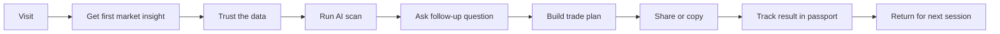

# STOCKCLAW Target UX User Journey Spec

작성일: 2026-03-07  
범위: `frontend/` 기준 target-state UX / GTM / PM 설계  
문서 목적: 현재 shipped code의 문제를 진단하고, 실제로 제품을 다시 설계할 때 따라야 할 목표 사용자 여정과 화면 구조를 정의한다.

## 1. 왜 새 문서가 필요한가

현재 제품은 기능은 많지만, 사용자 입장에서는 아래 4가지가 한 화면에서 섞여 보인다.

- 계정/인증
- 시장 데이터
- AI 스캔 결과
- 차트 패턴/거래 액션

이 4개가 명확히 분리되어야 신뢰가 생기는데, 현재는 다음 문제가 있다.

1. 월렛 연결, 회원가입, 로그인, 계정 복구, 월렛 링크가 한 modal 안에서 뒤섞여 있다.
2. 타임프레임을 바꾸면 차트는 바뀌지만, 이전 스캔 결과가 그대로 남을 수 있어 사용자가 "이 결과가 지금 차트 기준인지" 헷갈린다.
3. 차트 지표, 24시간 수치, AI 스캔 confidence, 패턴 detection이 모두 같은 종류의 숫자처럼 보인다.
4. 패턴은 visible-range 기반 재탐지 성격이 있어, 확대/축소나 timeframe 전환 시 다른 모양처럼 보일 수 있다.

이 문서는 이 문제를 고치기 위한 target-state 설계 문서다.

## 2. 현재 코드에서 확인된 핵심 문제

### 2.1 인증/계정 문제

현재 서버 로그인은 사실상 아래 3개가 모두 맞아야 한다.

- `email`
- `nickname`
- `walletAddress`

즉, 사용자가 체감하는 "내 계정이 있다"와 서버가 말하는 "이 조합이 맞다"가 다르다.

현재 코드상 문제점:

- 회원가입과 로그인을 사용자가 직접 고르게 하지만, 실제로는 서버가 계정 상태를 먼저 판별해야 한다.
- 로그인에 `nickname`까지 강제돼 있어 일반적인 web3 로그인 패턴과 맞지 않는다.
- 가입 시 email/nickname 충돌만 검사하고, wallet ownership 기반 account resolution은 분리돼 있다.
- wallet verify는 별도 endpoint이지만, signup/login과 UX적으로 하나의 흐름으로 정리되어 있지 않다.
- 기존 계정이 아닌데도 "이미 있다"처럼 보이거나, 반대로 다른 조합 충돌을 명확히 설명하지 못할 가능성이 높다.

### 2.2 타임프레임/스캔 문제

현재 코드상 timeframe 변경 시:

- 차트 데이터는 새 timeframe으로 다시 로드된다.
- pair/timeframe은 `gameState`에 즉시 반영된다.
- 하지만 `latestScan`은 자동으로 clear되지 않는다.

즉, 사용자가 `4H`에서 본 scan 결과가 `1H` 차트 위에 남아 있을 수 있다.

이건 UX상 치명적이다.

- 차트는 새 timeframe
- AI verdict는 이전 timeframe
- 사용자는 둘이 같은 기준이라고 오해할 수 있다

### 2.3 시장 데이터/지표 신뢰 모델 문제

현재 코드 기준 데이터는 사실 3종류다.

1. 차트 원본 데이터
   - Binance REST klines
   - Binance websocket kline / miniTicker
2. 차트 파생 지표
   - RSI, SMA 등은 클라이언트에서 klines 기반 계산
3. AI 스캔
   - 서버 scan engine/LLM scan이 만든 discrete snapshot

현재 문제는 이 셋의 provenance가 UI에서 구분되지 않는다는 점이다.

사용자가 묻게 되는 질문:

- "이 수치는 Binance 기준인가?"
- "TradingView랑 왜 다르지?"
- "이 scan 결과는 지금 차트 기준인가?"

지금은 이 질문에 화면 자체가 답하지 못한다.

### 2.4 패턴 엔진 문제

현재 패턴 detection은:

- `head_and_shoulders`
- `falling_wedge`

두 종류만 구현되어 있다.

동작 방식:

- pivot 탐지
- 회귀선/기울기/수축 정도 계산
- visible range 또는 full range 기준 detection
- overlay top patterns만 표시

현재 문제:

- visible range가 작으면 fallback/full로 바뀌거나 감지가 실패한다
- timeframe이 달라지면 candle structure 자체가 달라져 다른 패턴처럼 보이는 것이 정상인데, 그 이유가 설명되지 않는다
- 일부 패턴은 off-screen 구간을 포함하는데 현재는 "짤려 보이는" 체감이 생길 수 있다

## 3. Target-State 설계 원칙

### 원칙 1. 한 화면에는 한 가지 판단만 시켜야 한다

- Home: "들어갈 것인가"
- Auth: "지갑 소유자가 맞는가"
- Terminal: "지금 무엇을 볼 것인가 / 무엇을 실행할 것인가"
- Signals: "무엇을 채택할 것인가"
- Passport: "내 성과가 무엇인가"
- Arena: "내 판단을 시험할 것인가"

### 원칙 2. 모든 숫자는 출처가 보여야 한다

- Market Data
- Derived Indicator
- AI Scan Snapshot
- Community Signal

### 원칙 3. timeframe 전환은 차트 전환이지, verdict 자동 갱신이 아니다

타임프레임 전환 후에는 반드시 아래 중 하나만 허용한다.

- `이전 스캔은 stale로 표시`
- `새 타임프레임 기준으로 즉시 rescan`

둘 다 아닌 상태를 허용하면 안 된다.

### 원칙 4. wallet-first여도 auth state resolution은 서버가 판별해야 한다

사용자에게 먼저 `회원가입 / 로그인`을 물으면 안 된다.  
먼저 월렛 소유권을 확인하고, 그 다음 서버가 상태를 해석해야 한다.

### 원칙 5. 패턴은 "그려지는 모양"이 아니라 "검출된 구조"로 보여야 한다

- 어떤 timeframe에서 검출됐는지
- 어떤 범위에서 검출됐는지
- 지금 화면이 전체 구조를 다 보여주는지

이 3개가 같이 보여야 한다.

## 4. Identity / Auth Target-State

## 4.1 계정 모델

계정의 primary key는 `user_id`다.  
사용자 입장에서 primary identity는 `wallet`이다.

권장 데이터 모델:

- `users`
  - `id`
  - `primary_wallet_address` unique nullable
  - `email` unique nullable
  - `nickname` unique
  - `status`
- `wallet_connections`
  - one-to-many 가능
  - 각 wallet는 전역 unique
- `sessions`
  - wallet-signed auth session

규칙:

1. 하나의 wallet는 하나의 계정에만 연결될 수 있다.
2. email은 optional이다.
3. email은 login credential이 아니라 recovery / notifications / GTM CRM key다.
4. nickname은 profile handle이지 auth factor가 아니다.
5. 로그인 판별은 `signed wallet -> linked account lookup`으로 끝나야 한다.

## 4.2 사용자가 보게 될 target auth flow

### Flow A. 새 사용자

1. `CONNECT WALLET`
2. wallet signature
3. 서버가 `linked account 없음` 판정
4. `Create your profile`
   - nickname 필수
   - email 선택
5. 계정 생성 완료
6. Passport onboarding으로 이동

### Flow B. 기존 사용자

1. `CONNECT WALLET`
2. wallet signature
3. 서버가 `linked account 존재` 판정
4. 즉시 로그인
5. "Welcome back" + Passport/Terminal로 이동

### Flow C. 로그인된 사용자의 wallet 연결

1. 이미 session 있음
2. `Link wallet`
3. wallet signature
4. 서버가
   - 미연결 wallet이면 현재 계정에 link
   - 다른 계정 소유 wallet이면 conflict screen 표시

### Flow D. email conflict / wallet conflict

사용자에게 절대 `이미 있음`만 보여주면 안 된다.

반드시 아래처럼 분리해야 한다.

- `이 이메일은 다른 계정에 연결돼 있습니다`
- `이 월렛은 이미 다른 계정에 연결돼 있습니다`
- `이 닉네임은 사용 중입니다`

그리고 각 conflict는 다음 CTA가 있어야 한다.

- `Use another email`
- `Continue with this wallet's account`
- `Contact support / recover`

## 4.3 Auth 화면 구조

모달이 아니라 full-screen sheet 또는 명확한 3-step surface를 권장한다.

1. Step 1: `Verify wallet ownership`
2. Step 2: `Account found / create profile / resolve conflict`
3. Step 3: `Success and destination`

금지:

- signup / login 버튼을 사용자가 먼저 선택
- nickname을 login factor로 사용
- wallet과 email mismatch를 하나의 generic error로 처리

## 4.4 Auth GTM

필수 이벤트:

- `auth_wallet_connect_click`
- `auth_wallet_connect_success`
- `auth_signature_requested`
- `auth_signature_success`
- `auth_resolution_result`
  - `new_user`
  - `existing_user`
  - `wallet_conflict`
  - `email_conflict`
  - `nickname_conflict`
- `auth_profile_create_submit`
- `auth_login_complete`
- `auth_link_wallet_complete`

필수 속성:

- `provider`
- `chain`
- `origin_surface`
- `resolution_type`
- `destination_surface`

## 5. Market Data / Scan Trust Model

## 5.1 UI에서 분리해서 보여줄 4개 레이어

### Layer A. Market Feed

정의:

- 실제 시세/캔들 데이터
- 출처: Binance 또는 TradingView widget source

화면 표기 예시:

- `Market Feed: Binance`
- `1H candles · live`

### Layer B. Derived Indicators

정의:

- RSI, SMA, volume ratio 등
- Layer A의 OHLCV로 계산한 파생 값

화면 표기 예시:

- `Indicators: local calc from Binance candles`

### Layer C. AI Scan Snapshot

정의:

- 특정 pair/timeframe/시각에서 생성된 AI verdict
- 실시간 스트림이 아니라 snapshot

화면 표기 예시:

- `AI Scan · BTC/USDT · 4H · 2m ago`

### Layer D. Actionable Plan

정의:

- AI scan + user follow-up 질문 + chart planning으로 만든 실행 계획

화면 표기 예시:

- `Trade Plan from AI Scan`

## 5.2 timeframe 변경의 target-state 규칙

### 현재 상태 문제

- 차트는 바뀌는데 scan은 남아 있음

### 목표 규칙

타임프레임 변경 시 아래 순서를 고정한다.

1. 차트와 지표는 즉시 새 timeframe으로 갱신
2. 기존 scan card는 남기되 `STALE` 배지 부착
3. 상단 verdict 영역에 mismatch를 명시
   - `Current chart: 1H`
   - `Last AI scan: 4H`
4. primary CTA는 자동으로 바뀐다
   - `Rescan 1H`
5. 사용자가 새 scan을 실행해야만 verdict가 active 상태로 복귀

선택 옵션:

- power user setting으로 `auto-rescan on timeframe change`

기본값은 `off`가 맞다.  
자동 재스캔은 비용과 의미가 크므로 implicit하게 하면 안 된다.

## 5.3 TradingView/거래소와의 정합성 규칙

차트와 지표가 TradingView와 100% 같다는 인상을 주면 안 된다.

이유:

- 현재 차트 candles는 Binance REST/WS 기준
- 지표는 client-side custom calculation
- TradingView studies와 세부 계산/세션 처리/aggregation이 다를 수 있음

따라서 target UI는 반드시 아래를 보여줘야 한다.

- `Feed Source`
- `Indicator Source`
- `Last Updated`
- `Timeframe`

사용자 기대값:

- "거래소 원본 데이터 기준"
- "지표는 이 데이터로 재계산된 값"
- "AI scan은 그 위에 올려진 별도 snapshot"

## 6. Pattern System Target-State

## 6.1 현재 알고리즘 요약

현재 구현은 다음 방식이다.

- `Head & Shoulders`
  - pivot highs/lows
  - shoulder symmetry
  - head lift
  - neckline breakout
- `Falling Wedge`
  - regression on highs/lows
  - contraction
  - band coverage
  - apex position

즉, "모양을 대충 그리는" 것이 아니라, candle array에서 구조를 검출하는 쪽이다.

## 6.2 왜 timeframe마다 다르게 보이는가

정상적인 이유:

- timeframe이 바뀌면 candle aggregation이 달라진다
- pivot point가 달라진다
- regression line이 달라진다
- pattern 성립 여부도 달라진다

문제는 이걸 UI가 설명하지 않는다는 점이다.

## 6.3 target pattern UX 규칙

### Rule 1. 패턴에는 항상 scope를 붙인다

- `Detected on: 4H`
- `Detection scope: Full 300 bars`
- `Visible on chart: Partial`

### Rule 2. visible range는 render scope이지 truth scope가 아니다

target-state에서는 detection을 아래처럼 나눈다.

1. detection scope
   - 기본: full rolling window
2. render scope
   - current visible viewport

즉, zoom을 바꿔도 "패턴 정의 자체"가 계속 바뀌면 안 된다.

### Rule 3. off-screen 구간은 잘라서 숨기지 말고 상태를 보여준다

- `Pattern extends beyond current viewport`
- `Focus full pattern`

### Rule 4. confidence를 모양 대신 수치로 보여준다

패턴 카드에 최소 표시:

- kind
- direction
- confidence
- status: `FORMING` / `CONFIRMED`
- timeframe
- detection window

### Rule 5. pattern change log를 남긴다

패턴이 바뀌는 이유는 아래 셋 중 하나여야 한다.

- timeframe changed
- new candle confirmed
- user switched detection mode

## 6.4 target pattern modes

사용자에게 아래 3개 모드를 준다.

- `Locked`
  - 마지막 full-scope detection 유지
- `Visible`
  - 현재 viewport 기준 quick scan
- `Auto`
  - full-scope detect 후 viewport에 맞게 render

기본값은 `Auto`.

## 7. Product North-Star Loop

이 루프가 제품의 기준이다.

- Home은 `Visit -> Get first market insight`
- Terminal은 `Trust -> Scan -> Ask -> Plan`
- Signals는 `Share -> Copy`
- Passport는 `Track -> Return`
- Arena는 `Skill proof`

## 8. Page-by-Page Target UX

## 8.1 Home

### 페이지 목표

- 5초 안에 제품 가치를 이해시킨다
- login이 아니라 first insight로 보낸다

### 목표 유저저니

1. 방문
2. 가치 제안 읽기
3. 가장 큰 CTA 클릭
4. 바로 terminal로 진입
5. first scan 실행

### 화면 구조

- Top: one sentence value proposition
- Middle: live demo-style terminal preview
- Primary CTA: `Start Free Scan`
- Secondary CTA: `Connect Wallet`
- Tertiary CTA: `See Community Signals`

### 없애야 할 것

- 너무 많은 feature 분기
- 아직 존재하지 않는 독립 surface처럼 보이는 `/oracle` 인상

### GTM 목표

- home visit -> terminal arrival
- terminal arrival -> first scan

## 8.2 Auth

### 페이지 목표

- "내가 누구인지"가 아니라 "이 wallet 소유자가 맞는지"를 빠르게 해결

### 목표 유저저니

1. connect wallet
2. sign message
3. 서버 resolution
4. create profile or sign in
5. next destination

### 화면 구조

- Left/Top: why signing is safe
- Center: current step
- Bottom CTA: single action only

### 핵심 카피

- `Verify wallet ownership`
- `We found your account`
- `Create your profile`
- `This wallet is linked to another account`

## 8.3 Terminal

### 페이지 목표

- 시장 데이터, AI 판단, 유저 액션을 가장 신뢰감 있게 연결

### 핵심 사용자 질문

- 지금 시장이 어떤 상태인가?
- 이 verdict는 어떤 timeframe 기준인가?
- 내가 지금 뭘 눌러야 하나?

### target layout

Desktop:

- Left rail: Scan / watchlist / market context
- Center: Chart
- Right rail: AI verdict / chat / action
- Bottom tray: positions / alerts / evidence

Mobile:

- Top sticky summary strip
- Center chart first
- Bottom sheet for AI/chat/actions

### target terminal flow

1. pair/timeframe 선택
2. 차트 갱신
3. verdict strip가 mismatch 여부 표시
4. `Run Scan`
5. scan result card 생성
6. `Ask why`
7. `Build plan`
8. `Share` 또는 `Track`

### verdict strip 규칙

항상 아래 5개를 보여준다.

- current pair
- current timeframe
- last scan timeframe
- freshness
- primary CTA

예시:

- `BTC/USDT`
- `Chart: 1H`
- `AI Scan: 4H · stale`
- `2m ago`
- `Rescan 1H`

### primary CTA 규칙

- no scan: `Run Scan`
- stale scan: `Rescan Current TF`
- fresh scan + no follow-up: `Ask AI`
- trade-ready: `Build Trade Plan`

현재처럼 `OPEN CHAT PLAN`이라는 모호한 표현은 쓰지 않는다.

### 지표/숫자 표시 규칙

차트 옆 패널에서 분리 표기:

- Market
- Indicators
- AI

예시:

- `24H Change (Binance)`
- `RSI 14 (local calc)`
- `AI Confidence (scan snapshot)`

### 타임프레임 전환 여정

1. timeframe 바꿈
2. candles reload
3. indicators recalc
4. old scan stale badge
5. CTA becomes `Rescan`

사용자는 이 상태를 즉시 이해할 수 있어야 한다.

## 8.4 Signals

### 페이지 목표

- signal distribution
- signal selection
- copy-trade handoff

### 정보구조

- `Feed`
- `Trending`
- `AI Leaderboard`

### target flow

1. user enters signals
2. chooses one of three intent tabs
3. sees trust metadata on each card
4. chooses `Track` or `Copy`
5. if copy -> terminal with preserved origin context

### 각 카드에 꼭 있어야 할 것

- origin
  - `community`
  - `ai`
  - `copied`
- timeframe
- created time
- risk summary
- copy allowed 여부

### leaderboard 규칙

AI leaderboard는 독립 page가 아니라 signals 안 분석 탭으로 유지한다.

각 row에는:

- sample size
- confidence interval
- timeframe coverage
- last active period

## 8.5 Passport

### 페이지 목표

- 사용자의 누적 행동을 다시 실행 가능한 형태로 요약

### target flow

1. open passport
2. see snapshot
3. understand what improved or regressed
4. pick next action

### 화면 구조

- Top: identity + tier + trust badge
- Section 1: performance summary
- Section 2: open positions / tracked signals
- Section 3: recommended next action
- Section 4: raw history

### 꼭 추가해야 할 것

- `What changed since last visit`
- `Best next action`

Passport는 기록 보관함이 아니라 리텐션 재시동 화면이어야 한다.

## 8.6 Arena

### 페이지 목표

- 판단 실력을 게임화해서 차별화

### target flow

1. choose mode
2. understand stakes
3. draft
4. hypothesis
5. battle
6. result
7. send result to passport

### 현재 대비 개선점

- Terminal과 Arena를 더 명확히 분리
  - Terminal = decision support
  - Arena = decision evaluation
- result screen에서 passport handoff CTA를 강하게 제공

## 8.7 Settings

### 페이지 목표

- behavior를 바꾸는 설정만 남긴다

우선 설정 후보:

- default timeframe
- auto-rescan on timeframe change
- pattern detection mode
- language
- density

지금처럼 단순 저장 화면이 아니라, 실제 터미널 동작을 바꾸는 설정이어야 한다.

## 9. GTM Redesign

## 9.1 이벤트 설계 원칙

이벤트는 화면 단위가 아니라 decision 단위로 정의한다.

### Home

- `home_view`
- `home_primary_cta_click`
- `home_connect_wallet_click`

### Auth

- `auth_wallet_connect_click`
- `auth_wallet_connected`
- `auth_signature_success`
- `auth_resolution_result`
- `auth_profile_created`
- `auth_login_completed`

### Terminal

- `terminal_pair_changed`
- `terminal_timeframe_changed`
- `terminal_scan_started`
- `terminal_scan_completed`
- `terminal_scan_marked_stale`
- `terminal_ai_question_sent`
- `terminal_ai_answer_received`
- `terminal_trade_plan_opened`
- `terminal_share_opened`
- `terminal_share_submitted`

### Signals

- `signals_tab_viewed`
- `signal_card_opened`
- `signal_tracked`
- `signal_copytrade_started`

### Passport

- `passport_opened`
- `passport_next_action_clicked`

### Arena

- `arena_mode_selected`
- `arena_draft_submitted`
- `arena_hypothesis_submitted`
- `arena_result_viewed`
- `arena_to_passport_clicked`

## 9.2 필수 공통 속성

- `pair`
- `timeframe`
- `origin_surface`
- `scan_timeframe`
- `scan_age_sec`
- `market_data_source`
- `auth_state`
- `user_type`
  - `guest`
  - `wallet_verified`
  - `signed_in`

## 10. 바로 반영해야 할 우선순위

### P0

1. auth flow를 `wallet verify -> server resolution -> create profile/login`으로 재설계
2. timeframe 변경 시 기존 scan을 `stale`로 처리
3. terminal에서 `market / indicator / ai` provenance 구분 UI 추가

### P1

1. terminal primary CTA 문구 체계 정리
2. pattern detection scope / timeframe / partial visibility 표시
3. signals card trust metadata 추가

### P2

1. passport next action 추천
2. arena 결과 -> passport handoff 강화
3. auto-rescan, pattern mode 같은 behavior settings 추가

## 11. 수용 기준

이 설계가 반영되면 사용자는 아래를 헷갈리지 않아야 한다.

1. 나는 지금 로그인 중인가, 가입 중인가, wallet link 중인가?
2. 지금 보는 AI verdict는 현재 chart timeframe 기준인가?
3. 이 숫자는 거래소 데이터인가, 지표 계산값인가, AI 판단값인가?
4. 이 패턴은 현재 viewport 때문에 잘려 보이는 것인가, 실제로 구조가 바뀐 것인가?
5. 이 화면에서 내가 다음에 눌러야 할 가장 중요한 버튼은 무엇인가?

이 5개가 명확해지지 않으면 UI를 아무리 예쁘게 바꿔도 제품 신뢰는 올라가지 않는다.
