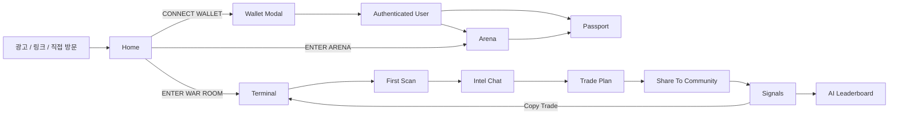

# STOCKCLAW Current User Journey Design

작성일: 2026-03-07  
기준 워크스페이스: `frontend/`  
문서 목적: 현재 shipped code를 기준으로, 사용자가 실제로 무엇을 보고 무엇을 누르고 어떤 결과를 체감하는지 PM, UI/UX, GTM 관점에서 고정한다.

## 1. 이 문서가 다루는 질문

- 유저는 어디서 들어오고 첫 클릭을 무엇으로 하게 되는가
- 클릭 직후 화면에서 무엇이 바뀌는가
- 사용자가 다음에 해야 할 행동은 무엇으로 유도되는가
- 어떤 상태와 API가 뒤에서 작동하는가
- 어떤 행동이 현재 GTM에 기록되고, 어디가 비어 있는가
- 어떤 지점에서 혼란이나 이탈이 발생할 수 있는가

이 문서는 페이지 IA 설명서가 아니다.  
본문은 `유저 여정`, 마지막은 `페이지별 인터랙션 인벤토리`로 정리한다.

## 2. 제품 경험 한 줄 요약

STOCKCLAW의 현재 경험은 아래 루프로 읽는 것이 가장 정확하다.

핵심은 다음이다.

- 지갑 연결 없이도 첫 가치 체험은 `Home -> Terminal -> Scan`으로 바로 시작된다.
- 지갑 연결은 탐색을 여는 장치가 아니라 `계정/기록/보유자산/지속성`을 여는 장치다.
- 터미널은 인사이트 생성 허브다.
- 시그널은 배포와 소비 허브다.
- 패스포트는 리텐션 허브다.
- 아레나는 실력 축적과 기록 생성 허브다.

## 3. North-Star User Journeys

### Journey 1. 첫 방문자가 첫 가치를 느끼는 여정

**유저 의도**

- "이게 뭔지 빨리 이해하고, 바로 뭔가 해보고 싶다."

**진입점**

- `/`

**사용자가 실제로 겪는 순서**

1. 사용자가 홈에 들어오면 애니메이션 히어로가 먼저 열린다.
   - 약 280ms 뒤 히어로가 fully reveal 된다.
   - 현재 GTM: `home_funnel` + `step=hero_view`
2. 사용자는 오른쪽 feature rail을 훑는다.
   - 데스크톱에서는 왼쪽 상세 패널이 바뀐다.
   - 모바일에서는 bottom sheet가 열린다.
   - 현재 GTM: `home_funnel` + `step=hero_feature_select`
3. 사용자가 가장 큰 CTA인 `ENTER WAR ROOM`을 누른다.
   - 즉시 `/terminal`로 이동한다.
   - 지갑 연결은 요구되지 않는다.
   - 현재 GTM: `home_funnel` + `step=hero_cta_click` + `cta=enter_war_room`
4. 사용자가 secondary CTA를 누르면 분기된다.
   - 미연결 상태: `CONNECT WALLET` 버튼이 wallet modal을 연다.
   - 연결 상태: `ENTER ARENA` 버튼이 `/arena`로 이동한다.
   - 현재 GTM: `home_funnel` + `step=hero_cta_click` + `cta=connect_wallet|enter_arena`
5. 사용자가 feature detail 안쪽 CTA를 누를 수도 있다.
   - `TERMINAL -> /terminal`
   - `ARENA -> /arena`
   - `SCANNER -> /signals`
   - `PASSPORT -> /passport`
   - `ORACLE -> /oracle`
6. 다만 현재 코드 기준으로 `ORACLE`은 독립 surface가 아니다.
   - `/oracle`은 실제로 `/signals?view=ai`로 보내는 redirect shim이다.

**유저가 화면에서 체감하는 결과**

- 홈은 설명보다 "바로 들어가서 해보라"는 제품이다.
- primary path는 회원가입이 아니라 `Terminal` 진입이다.
- 홈에서 체감되는 성공 순간은 "복잡한 가입 없이 War Room으로 들어갔다"이다.

**다음 기대 행동**

- 터미널에서 `RUN FIRST SCAN`

**PM 관점**

- 현재 홈의 primary KPI는 회원가입보다 `terminal landing`이 더 자연스럽다.
- onboarding의 실제 첫 가치 지점은 Home이 아니라 Terminal의 첫 scan이다.
- `ORACLE` 카드가 여전히 별도 페이지처럼 보이지만 실제론 redirect이므로, 정보구조와 카피를 맞추는 작업이 필요하다.

**UI/UX 관점**

- 데스크톱과 모바일 feature exploration 패턴이 다르다.
- secondary CTA는 연결 여부에 따라 완전히 다른 의미를 가진다.
- 홈은 "브랜드 소개 페이지"보다 "결정 유도형 입구"로 봐야 한다.

**GTM 관점**

- 현재 있는 이벤트:
  - `home_funnel: hero_view`
  - `home_funnel: hero_feature_select`
  - `home_funnel: hero_cta_click`
- 현재 비는 지점:
  - feature detail 내부 CTA click
  - `/oracle` redirect 이후 실제 `ai leaderboard arrival`
  - home에서 terminal 진입 후 첫 scan까지 연결되는 cross-page funnel

### Journey 2. 익명 방문자가 연결된 사용자로 전환되는 여정

**유저 의도**

- "지갑을 붙이고 계정을 만들고 싶다."
- "내 기록과 자산을 저장하고 싶다."

**진입점**

- 홈 secondary CTA
- 헤더 `CONNECT`
- 패스포트의 `CONNECT WALLET`
- 기타 전역 `openWalletModal()` 호출 지점

**사용자가 실제로 겪는 순서**

1. wallet modal이 열린다.
   - 현재 GTM: `wallet_funnel` + `step=modal_open`
   - 모달 제목은 단계에 따라 `WALLET ACCESS`, `CONNECT WALLET`, `VERIFY OWNERSHIP` 등으로 바뀐다.
2. 사용자는 provider를 고른다.
   - MetaMask
   - Coinbase
   - WalletConnect
   - Phantom
3. 연결이 성공하면 모달은 `VERIFY OWNERSHIP` 단계로 이동한다.
   - 현재 GTM: `wallet_funnel` + `step=connect`
4. 사용자는 지갑 서명을 수행한다.
   - 서버에서 nonce/message를 받고, 브라우저 지갑이 서명한다.
   - 현재 GTM: `wallet_funnel` + `step=sign`
5. 서명이 끝나면 사용자는 `signup` 또는 `login` 폼으로 들어간다.
   - signup: 이메일 + 닉네임
   - login: 이메일 중심
6. 인증이 성공하면 세션이 생성되고, authenticated user projection이 store에 반영된다.
   - 현재 GTM: `wallet_funnel` + `step=auth` + `status=success|error`
7. 사용자는 모달에서 `VIEW PASSPORT` 또는 `OPEN PASSPORT`로 이동할 수 있다.
8. 이후 재방문 시에는 헤더가 세션을 hydrate해서 연결 상태를 복원한다.
9. 사용자가 연결 해제를 누르면 logout과 로컬 정리가 함께 수행된다.
   - 현재 GTM: `wallet_funnel` + `step=disconnect`

**유저가 화면에서 체감하는 결과**

- 단순 "지갑 연결"이 아니라, 실제로는 `연결 -> 서명 -> 계정 생성/로그인`의 3단계 인증 플로우다.
- 성공 시 사용자는 패스포트, 보유자산 동기화, 서버 저장형 프로필/트레이드 기록으로 이어질 수 있다.

**다음 기대 행동**

- 패스포트 열기
- 터미널에서 기록 가능한 행동 시작
- 아레나에서 매치 기록 쌓기

**PM 관점**

- 브라우징과 첫 value는 wallet-free다.
- wallet funnel은 acquisition funnel이 아니라 persistence funnel에 가깝다.
- "지갑만 연결"과 "세션/계정까지 완료"를 KPI에서 분리해 봐야 한다.

**UI/UX 관점**

- 현재 플로우는 사용자가 보기엔 하나의 modal이지만, 내부적으로는 step machine이다.
- connect success 이후 다시 sign/auth를 요구하므로, 각 단계의 이유 설명이 중요하다.
- 에러 메시지는 현재 form validation / reject / timeout / wallet / signature / network 정도로 분류된다.

**GTM 관점**

- 현재 있는 이벤트:
  - `wallet_funnel` with `step=modal_open|connect|sign|auth|disconnect`
  - `status=view|success|error`
- 현재 비는 지점:
  - 어떤 화면에서 modal을 열었는지 `origin surface`
  - auth 성공 후 사용자가 어디로 이어졌는지 `post-auth destination`
  - provider별 completion rate 대시보드에 필요한 일관된 `provider_selected`

### Journey 3. 터미널에서 첫 scan을 실행하는 여정

**유저 의도**

- "지금 이 코인에서 무슨 방향성이 보이는지 빨리 알고 싶다."

**진입점**

- 홈 primary CTA
- 헤더/하단 네비게이션에서 `/terminal`
- 시그널의 copy trade handoff 이후 `/terminal`

**사용자가 실제로 겪는 순서**

1. 사용자가 `/terminal`에 들어온다.
   - 레이아웃은 mobile / tablet / desktop으로 분기된다.
   - 모바일은 자체 nav를 쓰고, 데스크톱은 양쪽 패널 구조를 쓴다.
2. 상단 control bar에 현재 시장 상태가 보인다.
   - pair
   - timeframe
   - consensus
   - confidence
   - density mode
   - primary CTA
3. 첫 방문 상태에서는 control bar가 이렇게 보인다.
   - `CONSENSUS = UNSCANNED`
   - `CONFIDENCE = --`
   - primary CTA = `RUN FIRST SCAN`
4. 사용자는 pair/timeframe을 바꿀 수 있다.
   - 현재 GTM:
     - `terminal_pair_change`
     - `terminal_timeframe_change`
5. 사용자가 `RUN FIRST SCAN`을 누른다.
   - 실행 위치는 decision rail, chart panel, war room 어느 쪽이든 될 수 있다.
   - 현재 GTM:
     - `terminal_scan_request_shell`
     - `terminal_scan_request_chart`
6. 모바일이라면 scan 요청 직후 적절한 탭으로 자동 전환될 수 있다.
   - 현재 GTM: `terminal_mobile_tab_auto_switch`
7. scan이 끝나면 터미널은 blank state에서 analysis state로 바뀐다.
   - consensus 라벨이 `LONG` 또는 `SHORT` 계열로 바뀐다.
   - confidence가 수치로 채워진다.
   - verdict meta가 있으면 `6/8`, `2m ago` 같은 합의도와 freshness가 표시된다.
   - chart 쪽에는 signal/trade setup이 반영된다.
   - war room / intel timeline에도 분석 흔적이 쌓인다.

**유저가 화면에서 체감하는 결과**

- "아무 것도 없는 상태"에서 "AI가 지금 이 시장을 어떻게 보고 있는지"가 보이는 상태로 바뀐다.
- 사용자는 이 시점부터 그냥 읽는 사람이 아니라, 질문하고 행동할 수 있는 상태가 된다.

**다음 기대 행동**

- Intel Chat에 질문해서 trade-ready setup을 끌어내기
- chart에서 trade plan 열기
- community로 공유하기

**PM 관점**

- 현재 제품의 첫 value moment는 `scan 결과가 control bar와 chart에 반영되는 순간`이다.
- wallet gating 없이 이 단계까지 갈 수 있다는 점이 acquisition에서 중요하다.

**UI/UX 관점**

- terminal의 핵심 상태 전이는 `unscanned -> scanning -> scanned`다.
- 첫 scan 이전의 CTA와 이후 CTA는 완전히 달라져야 한다.
- 모바일 auto-switch는 유용하지만, 사용자가 갑자기 화면이 이동했다고 느낄 수 있으니 이유를 설명하는 affordance가 중요하다.

**GTM 관점**

- 현재 있는 이벤트:
  - `terminal_mobile_view`
  - `terminal_mobile_nav_impression`
  - `terminal_mobile_tab_change`
  - `terminal_density_mode_toggle`
  - `terminal_pair_change`
  - `terminal_timeframe_change`
  - `terminal_scan_request_shell`
  - `terminal_scan_request_chart`
- 현재 비는 지점:
  - scan complete success/fail의 UI-visible milestone
  - first scan까지 걸린 시간
  - home entry source와 first scan success를 연결하는 funnel ID

### Journey 4. scan 결과를 질문으로 바꾸고 trade plan으로 전환하는 여정

**유저 의도**

- "이 방향이 왜 나왔는지 알고 싶다."
- "그냥 시그널이 아니라 실제 진입 계획으로 보고 싶다."

**사용자가 실제로 겪는 순서**

1. 사용자는 Intel Chat에 질문을 입력한다.
   - 질문은 즉시 `YOU` 메시지로 대화창에 표시된다.
   - 현재 GTM: `terminal_chat_question_sent`
2. 질문이 pattern scan 의도라면 일반 답변 대신 chart visible-range pattern scan이 실행된다.
   - 성공 시 chat에 패턴 결과가 메시지로 들어온다.
   - 실패 시 fallback 오류 메시지가 들어온다.
   - 현재 GTM:
     - `terminal_pattern_scan_request`
     - `terminal_pattern_scan_request_failed`
3. 일반 질문이라면 `/api/chat/messages`를 거쳐 agent reply가 돌아온다.
   - 성공 시 agent 말풍선이 chat에 append 된다.
   - 현재 GTM: `terminal_chat_answer_received`
4. 서버 답변이 실패해도 대화는 완전히 끊기지 않는다.
   - offline fallback reply가 생성돼서 대화창에 들어온다.
   - 필요하면 trade-ready 상태도 offline reply 기준으로 복구된다.
   - 현재 GTM: `terminal_chat_answer_error`
5. 이 시점부터 control bar의 primary CTA 의미가 바뀐다.
   - latest scan 없음: `RUN FIRST SCAN`
   - latest scan 있음 + chat trade-ready 아님: 라벨은 `OPEN CHAT PLAN`
   - latest scan 있음 + chat trade-ready임: `TRADE LONG` 또는 `TRADE SHORT`
6. 사용자가 primary CTA를 누르면 실제 동작은 아래처럼 갈린다.
   - scan 없음: scan 요청
   - scan 있음 + trade-ready 아님: chat 입력으로 포커스 이동
   - trade-ready임: chart planner / trade drawing 활성화
   - 현재 GTM:
     - `terminal_trade_plan_request_blocked`
     - `terminal_trade_plan_request`
     - `terminal_trade_plan_request_failed`
7. trade-ready 상태에서 CTA가 성공하면 chart에 진입선/TP/SL을 그리는 trade planning UI가 열린다.
   - 사용자는 텍스트 인사이트가 아니라 차트 위 행동 계획을 보게 된다.

**유저가 화면에서 체감하는 결과**

- 질문이 단순 FAQ가 아니라 실제 chart action으로 연결된다.
- 성공 순간은 "agent가 말해줬다"가 아니라 "내가 차트 위에서 entry/TP/SL을 볼 수 있다"이다.

**다음 기대 행동**

- trade plan을 바탕으로 quick trade / copy trade / community share

**PM 관점**

- 현재 가장 중요한 미세 전환은 `scan complete -> first chat question -> trade plan open`이다.
- 이 구간이 좋으면 터미널 체류시간과 후속 행동이 커진다.
- 현재 라벨/행동 불일치가 있다.
  - 사용자는 `OPEN CHAT PLAN`을 보지만,
  - trade-ready가 아니면 실제론 `chat focus`가 일어난다.
  - 이건 현재 code truth이고, 설계적으로는 분리할지 카피를 고칠지 결정이 필요하다.

**UI/UX 관점**

- chat 실패 시에도 완전 blank로 두지 않고 fallback reply를 보여주는 건 좋다.
- 다만 CTA copy는 행동과 일치해야 한다.
- "질문 -> 대답 -> 차트 계획"의 3단 흐름을 더 명확히 강조할 수 있다.

**GTM 관점**

- 현재 있는 이벤트:
  - `terminal_chat_question_sent`
  - `terminal_chat_answer_received`
  - `terminal_chat_answer_error`
  - `terminal_chat_request_shell`
  - `terminal_chat_request_chart`
  - `terminal_pattern_scan_request`
  - `terminal_pattern_scan_request_failed`
  - `terminal_trade_plan_request`
  - `terminal_trade_plan_request_blocked`
  - `terminal_trade_plan_request_failed`
- 현재 비는 지점:
  - control bar primary CTA 자체 click 이벤트
  - chat reply 이후 사용자가 실제 plan open까지 갔는지의 conversion rate
  - blocked case에서 사용자가 다시 질문을 보냈는지 여부

### Journey 5. 차트 인사이트를 커뮤니티 포스트로 바꾸는 여정

**유저 의도**

- "이 시그널을 남들에게 공유하고 싶다."
- "내 분석을 피드에 올리고 반응을 받고 싶다."

**진입점**

- terminal chart의 `📡 공유`
- chart header의 `▲ LONG 공유`, `▼ SHORT 공유`
- war room signal feed의 `SHARE`

**사용자가 실제로 겪는 순서**

1. 사용자가 공유 CTA를 누른다.
   - chart에서 온 경우 signal detail이 prefill 된다.
   - 일반 공유 버튼이면 현재 pair / timeframe / live price 힌트만 넣고 modal이 열린다.
   - 현재 GTM: chart에서 prefilled share를 시작한 경우 `terminal_chart_community_signal`
2. 공유 modal 제목은 `커뮤니티에 공유`다.
3. 사용자는 3단 wizard를 돈다.
   - 1단계: 근거 검토
   - 2단계: 방향 / pair / timeframe / entry / TP / SL / confidence / copy 허용
   - 3단계: 본문 작성 / preview / 제출
4. 사용자가 제출하면 community post가 생성된다.
   - `addCommunityPost(...)`
   - attachment와 allowCopy가 함께 저장된다.
5. 제출 후 terminal community runtime이 추가 후처리를 한다.
   - tracked signal 생성
   - tracked count 증가
   - notification 발생
6. terminal route는 공유 완료 후 `/signals`로 이동시킨다.

**유저가 화면에서 체감하는 결과**

- 터미널 안에서 만든 인사이트가 커뮤니티 피드로 옮겨진다.
- 사용자는 "분석"에서 "배포" 단계로 넘어간다.

**다음 기대 행동**

- `/signals`에서 자신의 포스트 확인
- 반응/복사 트레이드 유도

**PM 관점**

- 현재 시그널 authoring은 `/signals`가 아니라 `terminal`에서만 시작된다.
- 즉, Signals는 creation surface가 아니라 distribution surface다.
- 이 distinction이 PRD와 내비게이션 카피에 반영돼야 한다.

**UI/UX 관점**

- prefilled share는 friction을 크게 줄인다.
- 현재 제출 성공 직후 바로 `/signals`로 이동하므로, modal 안 success feedback은 짧다.
- `allowCopy`는 user-generated signal의 퍼포먼스/책임감을 좌우하므로 더 명시적으로 보여줄 가치가 있다.

**GTM 관점**

- 현재 있는 이벤트:
  - `terminal_chart_community_signal` only for chart-origin share handoff
- 현재 비는 지점:
  - share modal open
  - wizard step drop-off
  - submit success / submit fail
  - post-created 후 `/signals` arrival

### Journey 6. 커뮤니티 피드에서 copy trade로 전환되는 여정

**유저 의도**

- "남이 올린 시그널을 따라 해보고 싶다."
- "커뮤니티 / AI 리더보드를 읽고 바로 액션으로 옮기고 싶다."

**진입점**

- `/signals`

**사용자가 실제로 겪는 순서**

1. 사용자가 signals에 들어오면 3개 탭 중 하나를 본다.
   - `feed`
   - `trending`
   - `ai`
2. `feed`에서는 아래를 할 수 있다.
   - 터미널로 가는 create CTA 보기
   - `all / long / short` 필터 전환
   - 카드별 reaction
   - signal track
   - copy trade
3. `trending`은 engagement 기준 상위 post를 보여준다.
4. `ai`는 `OracleLeaderboard`를 embedded 상태로 보여준다.
   - period: `7D / 30D / ALL`
   - sort: `WILSON / ACCURACY / SAMPLE / CALIBRATION`
   - row click 시 detail overlay가 열린다.
   - 데이터가 없으면 `START ARENA BATTLE` CTA가 `/arena`로 보낸다.
5. 사용자가 post에서 `copy trade`를 누르면 즉시 `/terminal?...`로 이동한다.
   - query에는 `copyTrade=1`, `pair`, `dir`, `entry`, `tp`, `sl`, `conf`, `source=community` 등이 들어간다.
6. terminal은 이 query를 읽고 copy trade draft를 자동으로 연다.
7. 사용자는 copy trade modal에서 3단계를 돈다.
   - 1단계: evidence 확인
   - 2단계: order / size / leverage / margin / TP / SL 조정
   - 3단계: review 후 `PUBLISH SIGNAL`
8. publish를 누르면 local optimistic 객체가 먼저 생성된다.
   - quick trade open
   - tracked signal 생성
9. 서버 publish가 성공하면 local id가 real id로 교체되고 profile이 rehydrate 된다.
10. 실패하면 local optimistic state를 롤백하고 경고 notification을 띄운다.

**유저가 화면에서 체감하는 결과**

- 커뮤니티 소비가 읽기로 끝나지 않고 바로 거래/추적으로 이어진다.
- 시그널 피드가 terminal 행동으로 되돌아가는 폐회로가 만들어져 있다.

**다음 기대 행동**

- quick trade 상태 확인
- 패스포트에서 누적 기록 보기

**PM 관점**

- `/signals`는 현재 `피드 + 인기 + AI leaderboard`의 3분할 구조다.
- 과거 문서에 있던 별도 `signals` 탭 구조로 보면 안 된다.
- AI leaderboard는 독립 route가 아니라 signals 하위 view다.

**UI/UX 관점**

- query-param handoff는 사용자가 의식하지 않는 전환이어야 한다.
- copy trade modal은 evidence -> configuration -> publish의 전형적인 buy-in flow로 잘 나뉘어 있다.
- 실패 시 rollback은 되어 있지만, 성공 후 "무엇이 실제로 생성됐는지"를 더 명시적으로 보여줄 수 있다.

**GTM 관점**

- 현재 확인된 explicit GTM 이벤트는 copy trade flow에 거의 없다.
- 현재 비는 지점:
  - signals tab switch
  - filter usage
  - reaction click
  - copy trade initiation
  - copy trade wizard step progression
  - publish success / failure
  - AI leaderboard row open

### Journey 7. 아레나에서 성과를 만들고 패스포트로 돌아오는 여정

#### 7-1. 메인 아레나 `/arena`

**유저 의도**

- "내 판단을 시험하고 싶다."
- "AI와 붙거나, 결과를 기록으로 남기고 싶다."

**사용자가 실제로 겪는 순서**

1. 사용자는 아레나 로비에 들어온다.
   - 모드 포털이 보인다.
   - PvE: `ENTER ARENA`
   - PvP: `FIND OPPONENT`
   - Tournament: 해금 조건에 따라 진입/잠금 표시
2. 현재 코드상 wallet gate UI는 존재하지만 비활성이다.
   - `false && !walletOk` 조건이라 실제로는 안 보인다.
3. 모드를 고르면 `DRAFT`로 들어가 squad를 구성한다.
4. 사용자가 deploy를 누르면 match 생성, draft 제출, 분석 시작이 이어진다.
5. 상단 phase tracker는 아래 순서를 보여준다.
   - `DRAFT -> SCAN -> HYPO -> BATTLE -> RESULT`
6. 분석 단계에서는 에이전트 의견과 chart/context가 쌓인다.
7. 가설 단계에서 사용자는 direction / RR / TP / SL 성격의 판단을 굳힌다.
8. battle 단계에서는 arena / chart / mission / card view를 오가며 결과를 본다.
9. result 단계에서 result panel이 뜬다.
   - `Play Again`
   - `Lobby`
10. match history, LP, wins/losses, streak 등은 이후 passport에서 다시 소비된다.
11. 서버 sync가 실패해도 match는 로컬에서 계속된다.
   - 이 경우 상단에 `Offline mode`가 뜬다.

**유저가 화면에서 체감하는 결과**

- 아레나는 단순 차트 툴이 아니라 "판단을 하나의 경기로 포장한 surface"다.
- 터미널이 인사이트 허브라면, 아레나는 skill/progression 허브다.

**PM 관점**

- 아레나는 retention과 differentiation을 만든다.
- 홈에서 바로 보내는 경로가 있지만, 실제 첫 value surface로는 여전히 terminal이 더 낮은 마찰이다.
- current code truth로는 wallet requirement가 없다.

**UI/UX 관점**

- 로비, draft, analysis, hypothesis, battle, result가 매우 강한 phase language를 가진다.
- result screen의 `Play Again / Lobby`는 재도전과 루프 복귀를 명확히 만든다.
- wallet gate가 비활성인데 카피/기획 문서가 활성인 것처럼 말하면 실제 체험과 어긋난다.

**GTM 관점**

- 이번 검토 범위에서 아레나 전용 funnel event 체계는 home/wallet/terminal만큼 명확히 surfaced되지 않았다.
- 최소 권장 계측:
  - mode selected
  - squad deployed
  - hypothesis submitted
  - battle result viewed
  - play again
  - go passport

#### 7-2. Arena War `/arena-war`

이 surface는 메인 아레나보다 더 명시적인 인간 vs AI 대결 flow다.

- phase 순서:
  - `SETUP`
  - `DRAFT`
  - `AI_ANALYZE`
  - `HUMAN_CALL`
  - `REVEAL`
  - `BATTLE`
  - `JUDGE`
  - `RESULT`
- 사용자는 setup에서 모드를 정하고, draft에서 팀을 짜고, 인간과 AI 판단이 분리된 상태로 reveal/judge를 경험한다.
- PM 관점에선 "내 판단 vs 모델 판단" 비교를 가장 선명하게 보여주는 실험 surface다.

#### 7-3. Arena v2 `/arena-v2`

이 surface는 메인 아레나의 간소화/실험형 버전이다.

- 시작점은 `START ROUND`
- phase 순서:
  - `LOBBY`
  - `DRAFT`
  - `ANALYSIS`
  - `HYPOTHESIS`
  - `BATTLE`
  - `RESULT`
- battle 중에는 숫자키 `1-4`로 view를 전환할 수 있다.
- PM 관점에서는 실험 surface로 유지하되, primary onboarding path로 오인되지 않게 위치를 관리해야 한다.

### Journey 8. 재방문 사용자가 패스포트에서 다음 행동을 고르는 여정

**유저 의도**

- "내 성과가 쌓였는지 보고 싶다."
- "다음으로 어디로 갈지 고르고 싶다."

**진입점**

- 헤더 `PASSPORT`
- wallet success 이후 passport link
- 일부 리다이렉트 `/holdings`

**사용자가 실제로 겪는 순서**

1. 사용자는 패스포트에 들어오면 탭 구조를 본다.
   - `WALLET`
   - `POSITIONS`
   - `PROFILE`
   - `ARENA`
2. 상단 quick actions는 현재 상태에 따라 달라진다.
   - `QUICK TRADE`
   - `START ARENA`
   - `SYNC HOLDINGS`
   - `CONNECT WALLET`
3. wallet tab에서 사용자는 연결 여부를 바로 체감한다.
   - 미연결: `CONNECT WALLET FOR DEFI`
   - 연결: 체인 / 잔액 표시
4. holdings sync를 누르면 상태 메시지가 바뀐다.
   - `Syncing wallet holdings...`
   - 성공 시 `Live holdings synced (...)`
   - 실패/미연결 시 fallback 메시지
5. profile tab에서는 성과 snapshot과 badges를 본다.
   - win rate
   - total PnL
   - total matches
   - streak
6. arena tab에서는 match history와 arena 기반 기록을 소비한다.
7. 사용자는 이 화면에서 다시 `/terminal` 또는 `/arena`로 돌아간다.

**유저가 화면에서 체감하는 결과**

- 패스포트는 "내가 누구인지"를 보여주는 요약 화면이다.
- 탐색 시작점이 아니라, 이미 만든 행동/성과를 다시 읽고 다음 행동을 고르는 화면이다.

**다음 기대 행동**

- quick trade로 재진입
- arena 재도전
- wallet 연결 및 holdings sync

**PM 관점**

- 패스포트는 retention hub다.
- 터미널/아레나가 이벤트를 만들고, 패스포트가 그 결과를 재맥락화한다.
- acquisition KPI보다 repeat engagement KPI와 맞물리는 surface다.

**UI/UX 관점**

- 패스포트는 탭형 정보 소비와 quick action이 결합된 구조다.
- 사용자가 "읽고 끝나는 화면"이 되지 않게 quick action rail이 중요하다.

**GTM 관점**

- 현재 있는 계측:
  - quick action buttons의 `data-gtm-area="passport"`
  - `data-gtm-action="open_terminal|open_arena|sync_holdings|connect_wallet"`
- 현재 비는 지점:
  - tab switch
  - holdings sync success/failure
  - profile/arena tab deep engagement
  - passport에서 실제 재진입한 downstream conversion

## 4. Cross-Surface Handoff Map

### Home -> Terminal

- 사용자 행동: `ENTER WAR ROOM`
- 기대 결과: 즉시 War Room 진입
- 제품 의미: acquisition에서 first value

### Home -> Wallet Modal

- 사용자 행동: `CONNECT WALLET`
- 기대 결과: modal step flow 시작
- 제품 의미: persistent identity 진입

### Home -> Arena

- 사용자 행동: 연결 상태에서 `ENTER ARENA`
- 기대 결과: lobby 진입
- 제품 의미: skill loop 진입

### Terminal -> Signals

- 사용자 행동: community share submit
- 기대 결과: `/signals` 이동
- 제품 의미: analysis를 distribution으로 전환

### Signals -> Terminal

- 사용자 행동: post에서 copy trade
- 기대 결과: `/terminal?copyTrade=1...` 후 modal auto-open
- 제품 의미: community consumption을 action으로 되돌림

### Arena -> Passport

- 사용자 행동: result 이후 history/record 소비
- 기대 결과: 패스포트에서 누적 성과 확인
- 제품 의미: battle를 retention record로 저장

### Legacy Shim Routes

- `/oracle` -> `/signals?view=ai`
- `/holdings` -> `/passport`
- `/live` -> `/signals`

이 3개는 현재 독립 제품 surface로 취급하면 안 된다.

## 5. 현재 코드 기준으로 꼭 알아야 하는 사실

1. `/signals`의 실제 탭은 `feed / trending / ai`다.
2. `/oracle`은 AI leaderboard의 소유 surface가 아니라 redirect shim이다.
3. 홈의 `ORACLE` feature card는 여전히 `/oracle`로 가지만, 실제 체험은 signals 안 AI 탭이다.
4. `/arena`의 wallet gate UI는 코드상 존재하지만 실제로는 꺼져 있다.
5. 시그널 작성은 현재 `/signals`가 아니라 `terminal`에서만 시작된다.
6. terminal control bar의 `OPEN CHAT PLAN`은 현재 라벨과 실제 동작이 완전히 일치하지 않는다.
   - trade-ready가 아니면 chart plan이 아니라 chat focus가 일어난다.
7. copy trade는 독립 route가 아니라 terminal query-param bootstrap + modal flow다.

## 6. GTM Inventory: 현재 있음 vs 비어 있음

### 이미 확인된 이벤트 축

- Home funnel
  - `home_funnel`
- Wallet funnel
  - `wallet_funnel`
- Terminal engagement/action
  - `terminal_mobile_view`
  - `terminal_mobile_nav_impression`
  - `terminal_mobile_tab_change`
  - `terminal_mobile_tab_auto_switch`
  - `terminal_density_mode_toggle`
  - `terminal_pair_change`
  - `terminal_timeframe_change`
  - `terminal_scan_request_shell`
  - `terminal_scan_request_chart`
  - `terminal_chat_request_shell`
  - `terminal_chat_request_chart`
  - `terminal_chat_question_sent`
  - `terminal_chat_answer_received`
  - `terminal_chat_answer_error`
  - `terminal_pattern_scan_request`
  - `terminal_pattern_scan_request_failed`
  - `terminal_trade_plan_request`
  - `terminal_trade_plan_request_blocked`
  - `terminal_trade_plan_request_failed`
  - `terminal_chart_community_signal`
  - chart/tradingview 보조 이벤트 다수
- Passport quick actions
  - `data-gtm-area="passport"` 기반 CTA 계측

### 우선적으로 채워야 하는 빈 구간

- share modal open / step progression / submit success
- signals 탭 전환 / filter 사용 / reaction / copy trade initiation
- copy trade modal open / step progression / publish success / publish fail
- arena mode selection / squad deploy / hypothesis submit / result viewed
- terminal scan success milestone
- terminal primary CTA click 자체
- wallet modal origin surface
- redirect shim arrival (`/oracle` -> `ai leaderboard`)

## 7. 부록: 페이지별 인터랙션 인벤토리

### `/`

- hero 보기
- feature rail 탐색
- `ENTER WAR ROOM`
- `CONNECT WALLET` 또는 `ENTER ARENA`
- feature detail CTA 이동

### `/terminal`

- pair/timeframe 변경
- scan 실행
- Intel Chat 질문
- pattern scan 요청
- trade plan 열기
- density mode 전환
- share modal 열기
- copy trade modal 열기

### `/signals`

- `feed / trending / ai` 탭 전환
- `all / long / short` 필터
- reaction
- track
- copy trade
- AI leaderboard period/sort 조정
- AI leaderboard row detail 열기

### `/passport`

- `wallet / positions / profile / arena` 탭 전환
- quick actions
- wallet connect
- holdings sync
- profile/badge/history 소비

### `/arena`

- mode 선택
- squad deploy
- phase 진행
- view picker 전환
- result에서 replay/play again/lobby

### `/arena-war`

- setup
- draft
- AI analyze
- human call
- reveal
- battle
- judge
- result

### `/arena-v2`

- `START ROUND`
- phase 진행
- battle view keyboard 전환
- play again / lobby

### `/agents`

- agent card 탐색
- 카드 선택으로 detail panel 열기/닫기

### `/settings`

- default timeframe 변경
- battle speed 변경
- language 변경
- 저장 상태 확인
  - `Saving to cloud...`
  - `Synced with account settings`
  - `Local mode`
- 로컬 데이터 reset

### Redirect / Shim

- `/oracle` -> AI leaderboard handoff
- `/holdings` -> passport handoff
- `/live` -> signals handoff

---

이 문서의 정본 의미는 다음이다.

- PM은 이 문서를 보고 "실제 onboarding / activation / retention loop"를 이해해야 한다.
- UI/UX는 이 문서를 보고 "각 단계에서 사용자가 무엇을 기대하는지"를 읽어야 한다.
- GTM은 이 문서를 보고 "이미 찍히는 이벤트와 비는 이벤트"를 바로 도출할 수 있어야 한다.

즉, 현재 제품은 `페이지 모음`이 아니라 `Home -> Terminal -> Signals/Passport/Arena`로 이어지는 행동 루프다.
